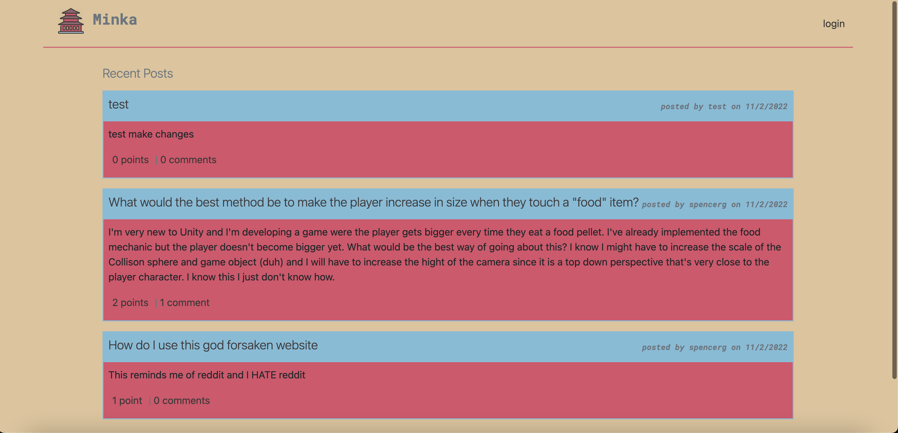

# Minka - Developers notes and questions forum
  
  ## Table of Contents
  * [Description](#description)
  * [Installation](#installation)
  * [Usage](#usage)
  * [Licenses](#licenses)
  * [Contributing](#contributing)
  * [Tests](#tests)
  * [Questions](#questions)
  * [Credits](#credits)

  ## Description 
  This project was created as project #2  of the 24 week full stack coding bootcamp at the U of U, this is a cms style blog/forum created  for the ease of students and other developers.
  
## Installation 
 git clone code or download repo as a zip
## Usage 
"npm i/npm install", "npm i bcrypt", "npm i connect-session-sequelize", "npm i dotenv", "npm i express-handlebars", "npm i express-session", "npm i mysql2, "npm i sequelize"
## Licenses 
  ## Licenses
    This project is covered under the MIT license. To learn more about what this means, click the license button at the top.
## Contributing 
send suggestions for new content or features to "spencergerritsen@gmail.com"
## Tests 
npm jest, this would be the reccommended test method.
## Questions 
Any questions about the project?
Github: https://github.com/sppencerr
Email: spencergerritsen@gmail.com
## Credits 
Minka

